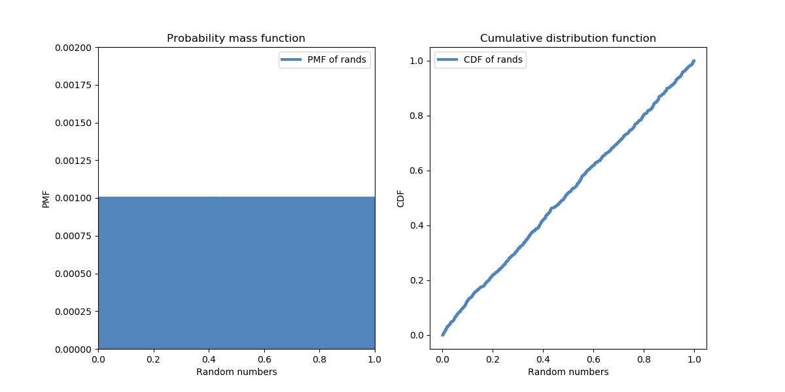

[Think Stats Chapter 4 Exercise 2](http://greenteapress.com/thinkstats2/html/thinkstats2005.html#toc41) (a random distribution)

```python
import thinkstats2
import thinkplot
import random

rands = [random.random() for i in range(1000)]

rands_pmf = thinkstats2.Pmf(rands, label='PMF of rands')
rands_cdf = thinkstats2.Cdf(rands, label='CDF of rands')

thinkplot.PrePlot(2, cols=2)

thinkplot.Pmf(rands_pmf)
thinkplot.Config(xlabel='Random numbers', ylabel='PMF',
                 title='Probability mass function',
                 axis=[0.0, 1.0, 0.0, 0.002])

thinkplot.PrePlot(2)
thinkplot.SubPlot(2)
thinkplot.Cdf(rands_cdf)
thinkplot.Show(xlabel='Random numbers', ylabel='CDF',
               title='Cumulative distribution function')
```



The plot generated by this code shows what we'd expect from a random sample: a horizontal line for the PMF (since every value is equally likely in the uniform distribution), and a more or less straight diagonal line for the CDF (since the percentile of each value should be roughly equal to the value itself in a 0.0 - 1.0 uniform random distribution).
