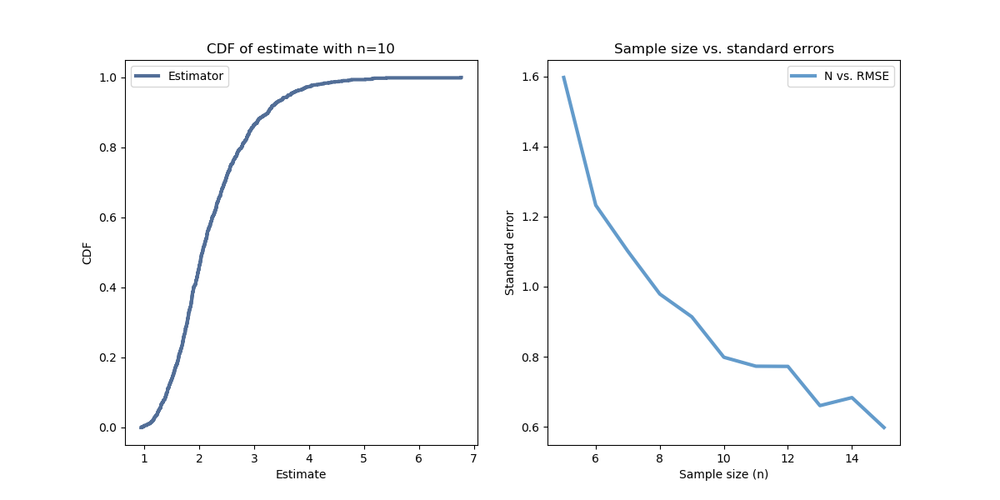

[Think Stats Chapter 8 Exercise 2](http://greenteapress.com/thinkstats2/html/thinkstats2009.html#toc77) (scoring)

```python
import numpy as np
import math
import thinkstats2
import thinkplot

def simulate(n=10, m=1000):
    lam = 2
    means = []
    for _ in range(m):
        xs = np.random.exponential(1.0/lam, n)
        means.append(1 / np.mean(xs))
        
    return means

def RMSE(estimates, actual):
    e2 = [(estimate-actual)**2 for estimate in estimates]
    mse = np.mean(e2)
    return math.sqrt(mse)

means10 = simulate()
error10 = RMSE(means10, 2)
cdf10 = thinkstats2.Cdf(means10)
ci10 = cdf10.Percentile(5), cdf10.Percentile(95)

thinkplot.PrePlot(cols=2)

plot1 = thinkplot.Cdf(cdf10, label="Estimator")
thinkplot.Config(xlabel="Estimate", ylabel="CDF",
                 title="CDF of estimate with n=10")

print("Standard error with n=10 is", error10)
print("Confidence interval with n=10 is", ci10)

ns = []
errors = []

for i in range(5, 16):
    ns.append(i)
    means = simulate(n=i)
    e = RMSE(means, 2)
    errors.append(e)

thinkplot.SubPlot(2)

plot2 = thinkplot.Plot(ns, errors, label="N vs. RMSE")
thinkplot.Config(xlabel="Sample size (n)", ylabel="Standard error",
                 title="Sample size vs. standard errors")
thinkplot.Show()
```

Output:

```
Standard error with n=10 is 0.7752960084522144
Confidence interval with n=10 is (1.2694252125558978, 3.623585382421542)
```


With a sample size of 10, standard error is approximately 0.78. The right-hand plot shows that this number goes down with each additional sample point, and is substantially higher with smaller sample sizes.
