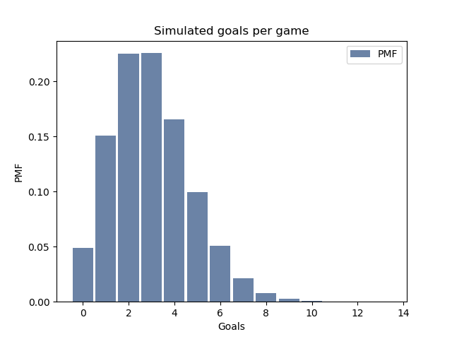

[Think Stats Chapter 8 Exercise 3](http://greenteapress.com/thinkstats2/html/thinkstats2009.html#toc77)

```python
import numpy as np
import thinkstats2
import thinkplot

def RMSE(estimates, actual):
    e2 = [(estimate-actual)**2 for estimate in estimates]
    mse = np.mean(e2)
    return np.sqrt(mse)

def gamesim(lam):
    game = 0
    goals = 0
    while game < 1:
        game += np.random.exponential(1.0/lam)
        goals += 1
    return goals - 1 #last one doesn't count

def manygames(avg, n):
    outcomes = []
    for _ in range(n):
        outcomes.append(gamesim(avg))
    mean_error = np.mean([i - avg for i in outcomes])
    print("Mean error:", mean_error)
    print("RMSE:", RMSE(outcomes, avg))
    pmf = thinkstats2.Pmf(outcomes)
    ci = pmf.Percentile(5), pmf.Percentile(95)
    print("Confidence interval:", ci)
    thinkplot.Hist(pmf, label="PMF")
    thinkplot.Config(xlabel="Goals", ylabel="PMF", title="Simulated goals per game")
    thinkplot.Show()
    
manygames(3, 100000)
```

Output:

```
Mean error: -0.00524
RMSE: 1.7312307760665533
Confidence interval: (1, 6)
```


The very small mean error indicates that the estimator is unbiased. RMSE is approximately 1.73; it rises with larger values of the first parameter (average number of goals per game). Ninety percent of the simulated games fall between 1 and 6 goals, which seems intuitively correct.

